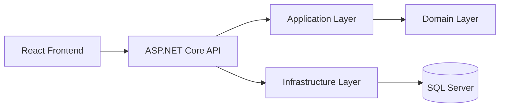

# FactoryFlow — Initial Architecture

## Layers

* **Frontend:** User interface.
* **API:** Receives HTTP requests.
* **Application:** Handles application use cases.
* **Domain:** Contains business rules.
* **Infrastructure:** Handles database and external services.
* **Database:** Stores application data.
