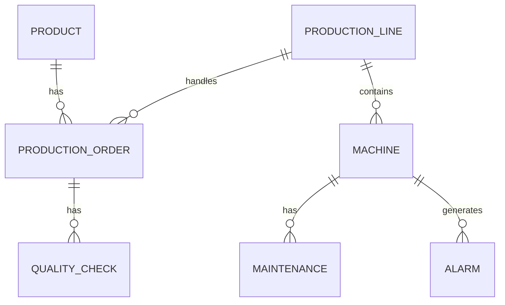

# FactoryFlow — Initial ER Diagram

```mermaid
erDiagram
    PRODUCT ||--o{ PRODUCTION_ORDER : has
    PRODUCTION_LINE ||--o{ MACHINE : contains
    PRODUCTION_LINE ||--o{ PRODUCTION_ORDER : handles
    MACHINE ||--o{ MAINTENANCE : has
    MACHINE ||--o{ ALARM : generates
    PRODUCTION_ORDER ||--o{ QUALITY_CHECK : has
```

## Main Entities

- Product
- Production Order
- Production Line
- Machine
- Maintenance
- Alarm
- Quality Check